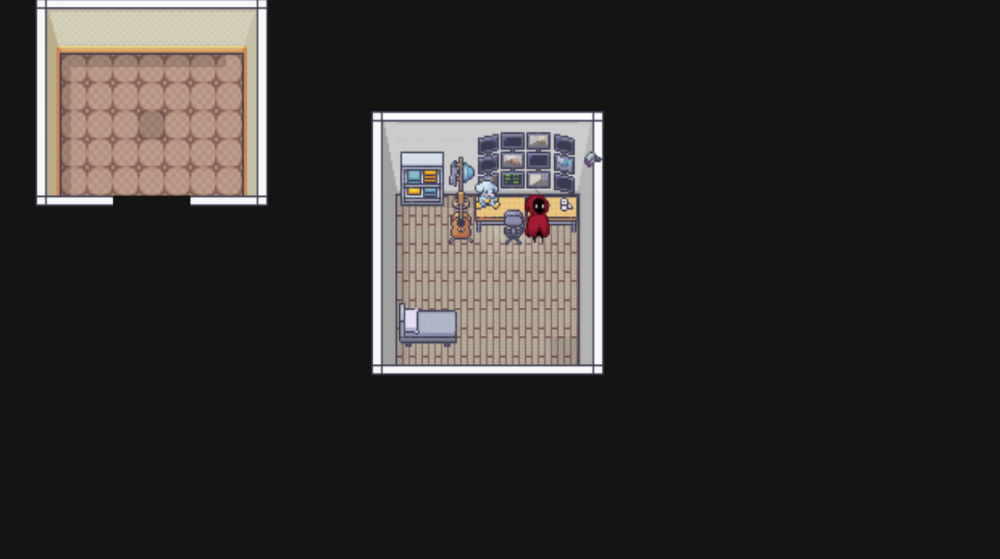

# 8964

a RPG made without a game engine.


## Screenshot



## Features

#### System:
- UI not available
- `RCLICK` / `LCLICK` to enter the game or reset player position

#### Player:
- Move with `W` `A` `S` `D`

#### Enemies:
(_pending_)

#### Map:
- Solitary Confinement (yeah)


## Installation

### Windows

**Prerequisites:**
- A configured C++ compiler, preferably [MinGW](https://sourceforge.net/projects/mingw/) or [MinGW-w64](https://www.mingw-w64.org/)
- Brain (optional)
- Compatible hardware

```bash
git clone https://github.com/NTDuck/8964 && cd 8964
.\compile.bat
```
    
### Others:

Official os-specific releases are not available, and compatibility layers (e.g. [wine](https://www.winehq.org/)) are not tested.


## Tech Stack

**Language**: C++ 17

**Dependencies:** 
- [SDL2](https://github.com/libsdl-org/SDL/releases/tag/release-2.28.3) 2.28.3, [SDL2_image](https://github.com/libsdl-org/SDL_image/releases/tag/release-2.6.3) 2.6.3
- [JSON for Modern C++](https://github.com/nlohmann/json/releases/tag/v3.11.2) 3.11.2
- [pugixml](https://github.com/zeux/pugixml/releases/tag/v1.14) 1.14
- [zlib](https://www.zlib.net/) 1.3 (with Microsoft Github's precompiled [zlib.dll](https://github.com/microsoft/malmo/files/5758471/zlib.zip))

**Third-party tools:**
- [Tiled](https://www.mapeditor.org/) 1.10.2 for level generation

**Compiler:** [MinGW GCC](https://github.com/niXman/mingw-builds-binaries/releases/tag/13.2.0-rt_v11-rev0) 13.2.0

**Version control:** Git (_2.40.0.windows.1_)


## Acknowledgements

> We would like to credit certain assets used in this project. Licenses, if any, should be found in the links below.
- [Hooded Protagonist](https://penzilla.itch.io/hooded-protagonist)
- [Enemy Galore](https://admurin.itch.io/enemy-galore-1)
- [Cat 50+ animations](https://bowpixel.itch.io/cat-50-animations)
- [Modern Interiors](https://limezu.itch.io/moderninteriors) (paid version)

> We would also like to recognize reknowned games from which certain concepts and mechanics in this project drew inspiration, which include but are not limited to [Elden Ring](https://store.steampowered.com/app/1245620/ELDEN_RING/), [Omori](https://www.omori-game.com/), [Undertale](https://store.steampowered.com/app/391540/Undertale/), and [The Coffin of Andy and Leyley](https://store.steampowered.com/app/2378900/The_Coffin_of_Andy_and_Leyley/).


## License

This project is licensed under the [BSD-3-Clause license](LICENSE).


## Support

For support, please email nguyentuduck@gmail.com.

